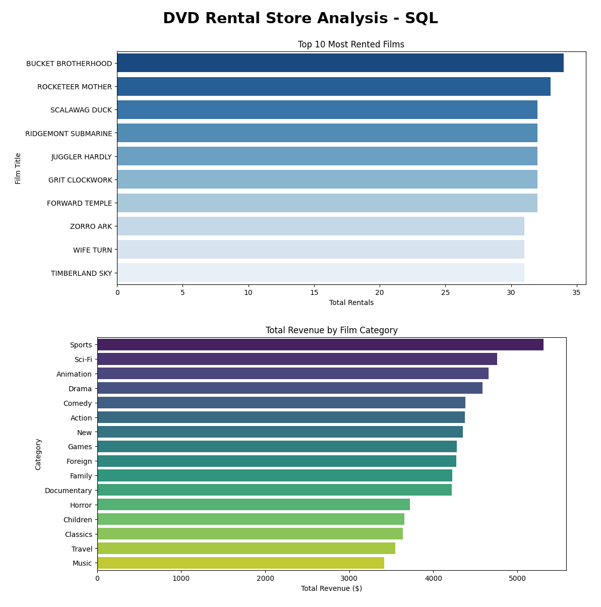

# DVD Rental Store Analysis - SQL & SQLite

## Project Overview
Analyzed a DVD rental store database (SQLite Sakila Sample Database, 16 tables) using complex SQL JOINs across 6 tables to identify top performing films, most valuable customers, and highest revenue categories. Completed as part of the York University Big Data Analytics Certificate (2024).

## About This Project
Inspired by SQL coursework in the York University Big Data Analytics Certificate (2024). I built this notebook independently in 2026.

## Tools Used
- Python
- SQLite
- SQL (multi-table JOINs, GROUP BY, COUNT, SUM)
- Pandas
- Matplotlib
- Seaborn

## Key Insights

1. Sports is the highest revenue category at $5,314.21 from 1,179 rentals
2. BUCKET BROTHERHOOD is the most rented film with 34 rentals
3. ELEANOR HUNT is the top customer by rentals (46 rentals, $216.54 spent)
4. KARL SEAL rented fewer films (45) but spent more ($221.55), so the most frequent renter is not the highest spender
5. Music is the lowest revenue category at $3,417.72

## SQL Tables Used
film, inventory, rental, payment, customer, category, film_category

## Dataset
SQLite Sakila Sample Database from Kaggle

## View Full Project on Kaggle
https://www.kaggle.com/code/lalitacanada/dvd-rental-store-analysis-sql-york-university
